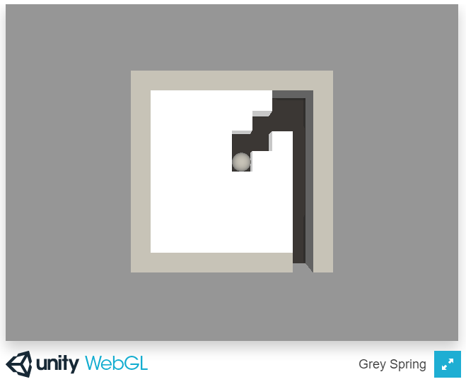
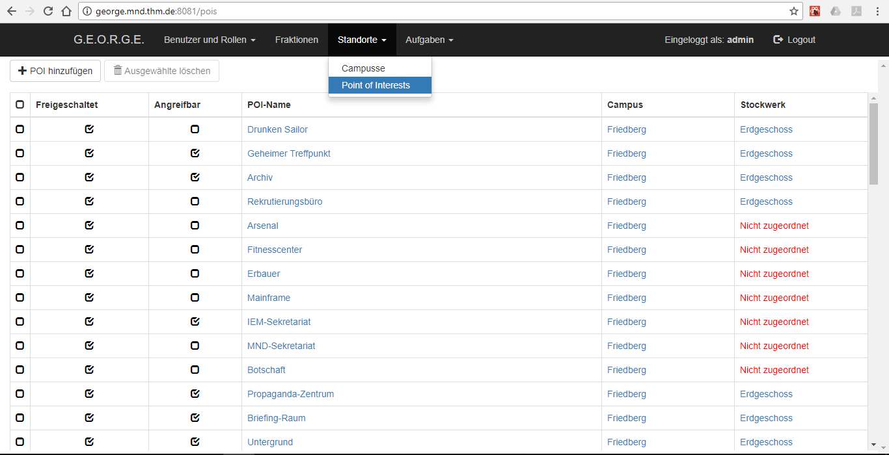
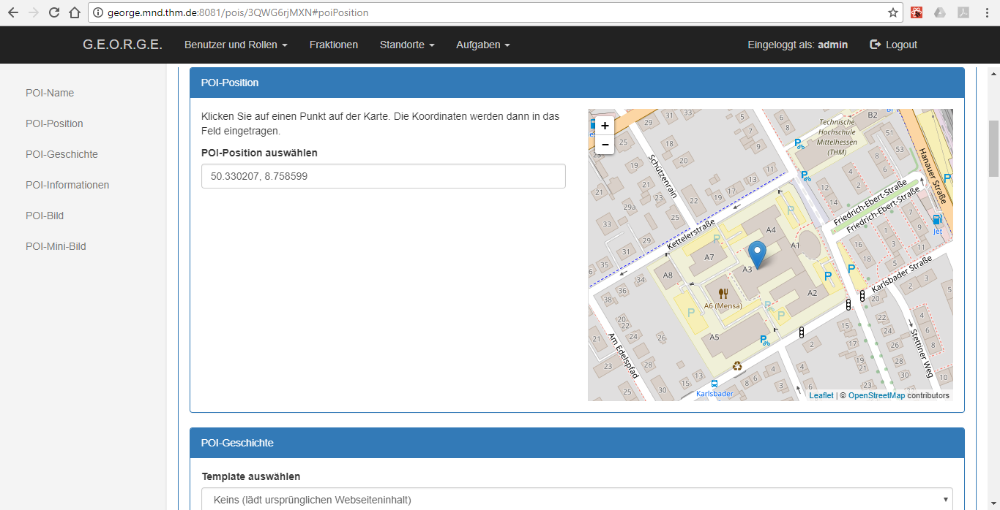
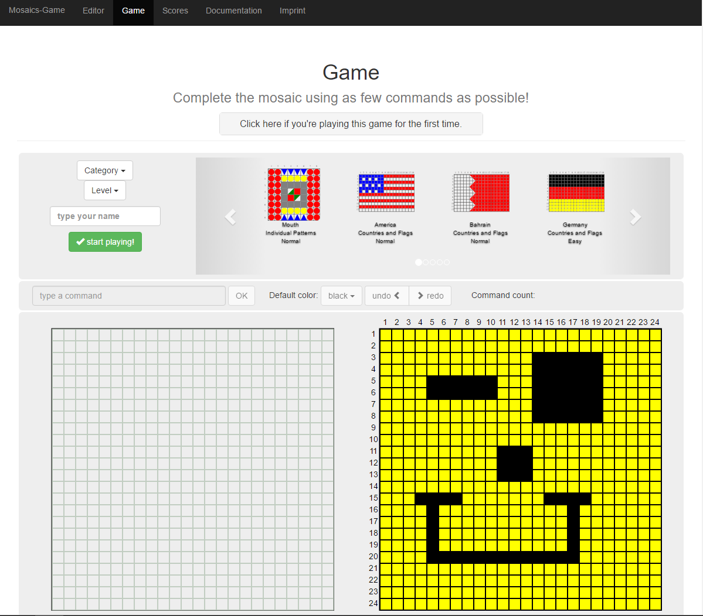
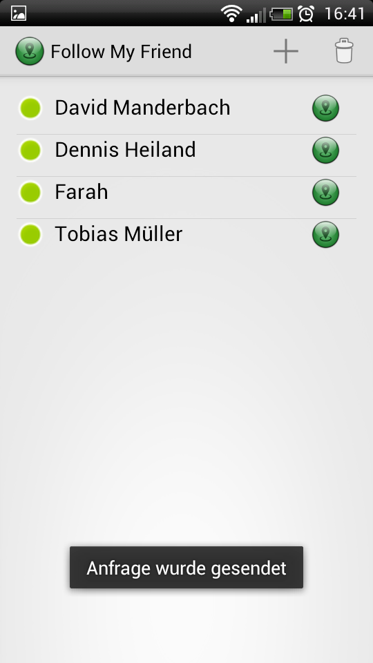
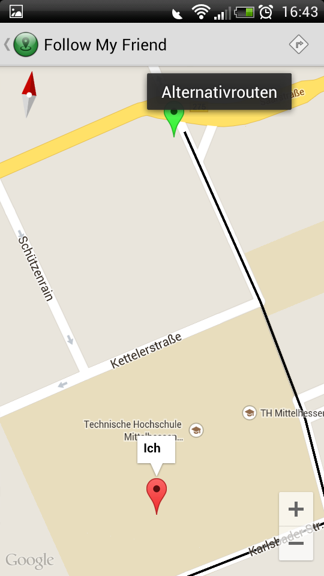
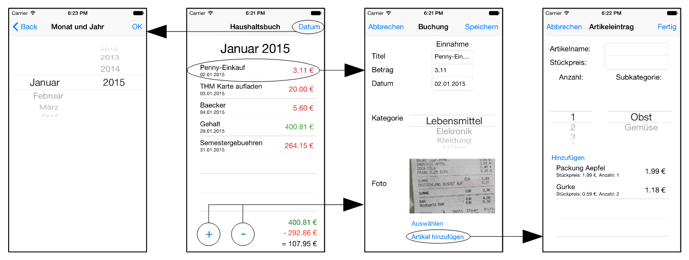

# Portfolio

Hello, my name is Martin Heller and this is my portfolio page.
On this page, I will present some projects I was involved in.

## Grey Spring / Spring it out! (Unity)

This project was created by Yannick and me in the course of a game jam at the Technische Hochschule Mittelhessen, a university of applied sciences, located in Friedberg (Hessen), Germany. It was hosted November 18-21, 2016.

* The goal is to get the sphere out of the labyrinth or "spring a prisoner from jail"
* It was made with Unity
* It is best played on Android with the accelerometer by tilting the smartphone  
* On other platforms it is played by using the **WASD keys**

It is available for 

* [WebGL (play now)](https://developer.cloud.unity3d.com/share/Z1SBocOEez/)  
* [Android (download)](https://developer.cloud.unity3d.com/share/b1Mu7LrNeM/)  
* [Windows (64bit) (download)](https://developer.cloud.unity3d.com/share/Zk7rC9OVxz/)  
* [Mac OS (universal) (download)](https://developer.cloud.unity3d.com/share/ZyOvp9O4lG/)  
* [Linux (universal) (download)](https://developer.cloud.unity3d.com/share/-ka0C5dNxf/)  

One may have a look at the sources by clicking this [repository link](https://github.com/Corvax-Fisher/Grey-Spring).  
One can get it for Android simply by scanning this QR code:

And this is what it looks like:

## Admin tool for the game 3S - Secret Science Society (Web)

This project was created by me in the course of my development project (for studies) and I continued developing it during my spare-time work both at Games@THM from March 2015 to December 2016.
Games@THM was a project of the Technische Hochschule Mittelhessen. During my time at this project, I worked on this tool, on the game 3S (web app), and on backend code for the game.

* The goal of the tool was to ease the administration of the content for the game 3S.
* It was developed iteratively by creating several prototypes, evaluating them, and including the feedback.
* It was created with HTML, CSS, JS, React, Parse, Parse+React, Node.js, NPM, webpack, and various NPM packages for react, like react-router to add routing.
* A paper was created (in german) for the work of the development project (first 6 months). [(Link to PDF)](doc/paper-final.pdf)

For each group of data, a table page and a form page was created, to administrate the datasets.
Because it was much about locations (point of interests), the table and form page of these will be shown.

The game 3S is a location-based alternate reality online serious game. It was developed by Games@THM to ease the orientation and networking of new students. For more informations about the game, please refer to this page (only in german language): <http://games.thm.de/3S/uber-3s/>

## Mosaics (Web)

This project was created by Farah, Sebastian and me during our master's degree studies of media informatics in the course of a module called "Dokumentenstrukturen" (english: document structures).  

+ The goal is to solve a mosaics puzzle by using as few commands as possible.  
+ It was created with HTML, CSS, JavaScript, SVG, PHP, and XML.  
+ It was tested for Firefox and Chrome.

[Try it out](http://mosaics-game.lima-city.de/)

One may have a look at the sources by clicking this [repository link](https://github.com/Corvax-Fisher/Mosaics-Game).

And this is what it looks like:

## Follow My Friend (Android)

* A paper was created (in german) for this project [(Link to PDF)](doc/Paper-FMI.pdf)

The App basically consists of two views/activities.

  
  

## Housekeeping book (iOS/Swift)

* A web-based documentation was created (in german) for this project [(Link)](fma14ws-teamF)

These are the views of the App:

